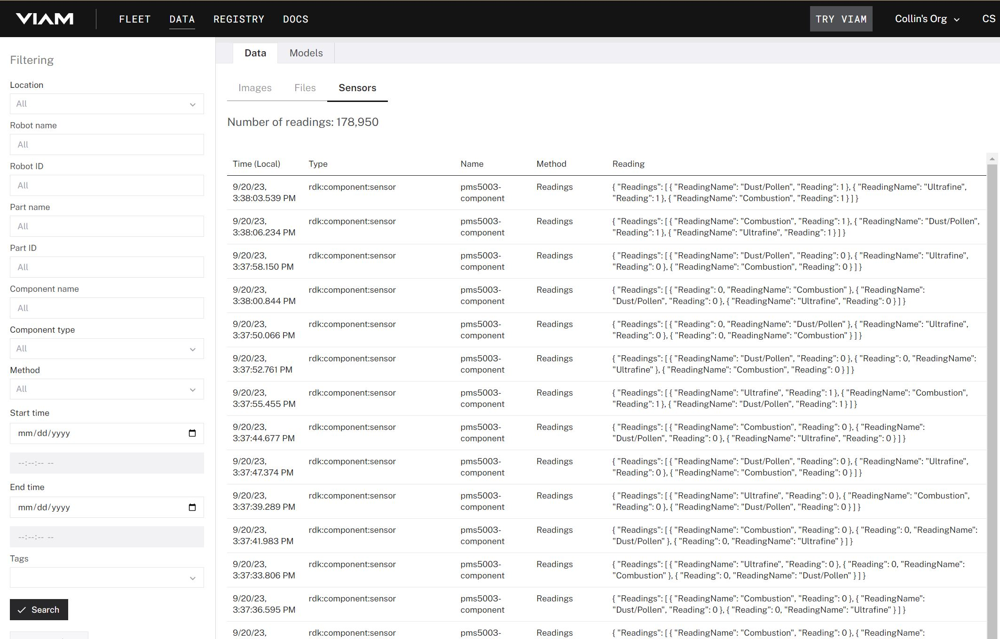
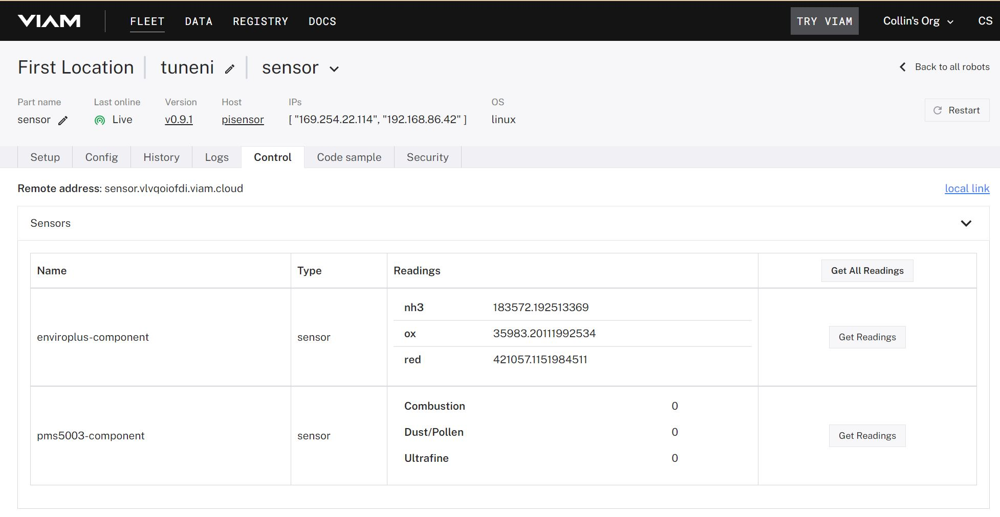

# pms5003 Viam Sensor Module

This repo used the Viam example sensor module to create a Python sensor for use in Viam robots. It uses the pms5003 Python library- https://github.com/pimoroni/pms5003-python. The sensor is here and we used the connector to the enviroplus board- https://www.kiwi-electronics.com/en/pms5003-particulate-matter-sensor-with-cable--4415


## Deploying and Using with a Viam Robot

1. Inside the repo, use the Viam CLI to create a meta.json template and register the module in the Viam registry/

```bash
viam module create --name "pms5003-sensor" --public-namespace "tuneni"
```
2. Once this is created, you need to update the `meta.json` to have the relevant fields as follows:
```json
{
  "module_id": "tuneni:pms5003-sensor",
  "visibility": "public",
  "url": "https://github.com/Fireline-Science/pms5003-sensor",
  "description": "This is the module that uses the pms5003 lib and pi hat to collect gas readings.",
  "models": [
    {
      "api": "rdk:component:sensor",
      "model": "tuneni:sensor:pms5003"
    }
  ],
  "entrypoint": "exec.sh"
}
```
3. Next, you need to update the registry with:
```bash
viam module update
```
4. Then, you need to tar the files Viam needs to deploy on the robot as follows. Note that you will have to make sure the file permissions allow the shell scripts and python scripts to be executed.
```bash
chmod 755 *.sh ./src
tar -czf module.tar.gz exec.sh requirements.txt src .env setup.sh
```
5. Then, you need to upload the file tar along with a version and platform which matches the OS of the robot for this file package:
```bash
viam module upload --version "0.0.1" --platform "linux/arm64" module.tar.gz
```
6. Next, to "deploy" the module to the robot, you go to the Viam app and create a new sensor component from the Viam registry. Note that the registry often does not display the updated sensor, so you may have to reload the page.


7. To set up the data collection, you need to configure the data capture configuration as shown below:


8. The module should be configured and available using the most recent version. This will look like the following:


9. If this is configured correctly, you should see a final message in the robot log like the following:

```
2023-09-20T21:47:24.257Z info robot_server.process.tuneni_pms5003-sensor_/root/.viam/packages/.data/module/8754658a-ccc0-4bab-8fd5-2dcd888d6b04-pms5003-sensor-0_0_3/exec.sh.StdOut   pexec/managed_process.go:224   \_ 2023-09-20 22:47:24,257 INFO viam.rpc.server (server.py:111) Serving on /tmp/viam-module-1486850233/tuneni_pms5003-sensor.sock 
```

10. Finally, there are at least three ways to get the data if the robot is on and sending data. First, if the data collection function is configured and turned on via the component "data capture configuration", you can go to the Data tab at the top of the Viam app to see the following:



You can also navigate to the "control" tab for the robot to call the get_readings API via the UI like this:



Finally, you can use the API via the client sdks. I will post more about that as I make progress.

### Set a secret if you want to use Github CI

Instructions for setting the secret are [here](https://github.com/viamrobotics/upload-module#setting-cli-config-secret).

## Sensor Readings

The pms5003 sensor estimates the particulate concentration in the air using a laser which radiates airborne particles and uses the scattering of the light to estimate the size and quantity of particles in the air. The datasheet for this sensor can be found [here](https://www.digikey.com/en/htmldatasheets/production/2903006/0/0/1/pms5003-series-manual).

For this module, we are retrieving three of the twelve readings that the pms5003 makes available. We are retrieving the three readings related to the estimated concentration of particles in a cubic meter.

Various federal and state authorities have established standard ways to measure particulate pollution using a standard referred to as particulate matter or PM. This standard measures inhalable particle concentrations by dividing the concentrations into two overlapping measures- PM2.5 and PM10. PM10 is the concentration of particles 10 nanometers or smaller. PM2.5 is the concentration of particles 2.5 nano meters or smaller. PM1 is similarly particles less than 1 nano meter in size.

According to the California Air Resources Board:

```
PM10 and PM2.5 often derive from different emissions sources, and also have different chemical compositions. Emissions from combustion of gasoline, oil, diesel fuel or wood produce much of the PM2.5 pollution found in outdoor air, as well as a significant proportion of PM10. PM10 also includes dust from construction sites, landfills and agriculture, wildfires and brush/waste burning, industrial sources, wind-blown dust from open lands, pollen and fragments of bacteria.

PM may be either directly emitted from sources (primary particles) or formed in the atmosphere through chemical reactions of gases (secondary particles) such as sulfur dioxide (SO2), nitrogen oxides (NOX), and certain organic compounds. These organic compounds can be emitted by both natural sources, such as trees and vegetation, as well as from man-made (anthropogenic) sources, such as industrial processes and motor vehicle exhaust. 
```

For the purposes of our Viam module, we are using the same reading labels as the Python pms5003 package. The following table describes each below.


| Sensor Label | Description | Values                                                              |
|--------------|-------------|---------------------------------------------------------------------|
| Ultrafine    | PM1.0       | Count of particles =< 1 micrometer in micro grams per cubic meter   |
| Combusition  | PM2.5       | Count of particles =< 2.5 micrometer in micro grams per cubic meter |
| Dust/Pollen  | PM10        | Count of particles =< 10 micrometer in micro grams per cubic meter  |


