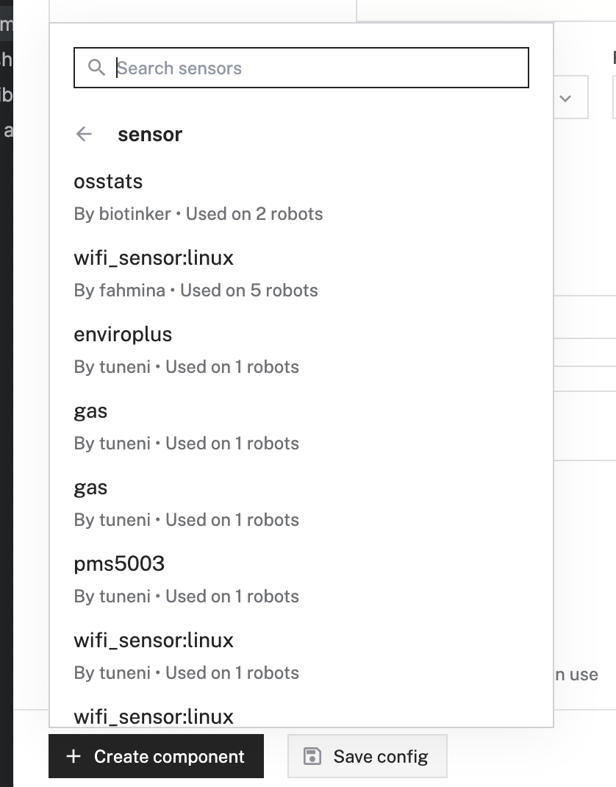

# pms5003 Viam Sensor Module

This repo used the Viam example sensor module to create a Python sensor for use in Viam robots. It uses the pms5003 Python library- https://github.com/pimoroni/pms5003-python. The sensor is here and we used the connector to the enviroplus board- https://www.kiwi-electronics.com/en/pms5003-particulate-matter-sensor-with-cable--4415


### Deploying to Viam

1. Inside the repo, use the Viam CLI to create a meta.json template and register the module in the Viam registry/

```bash
viam module create --name "pms5003-sensor" --public-namespace "tuneni"
```
2. Once this is created, you need to update the `meta.json` to have the relevant fields as follows:
```json
{
  "module_id": "tuneni:pms5003-sensor",
  "visibility": "public",
  "url": "https://github.com/Fireline-Science/pms5003-sensor",
  "description": "This is the module that uses the pms5003 lib and pi hat to collect gas readings.",
  "models": [
    {
      "api": "rdk:component:sensor",
      "model": "tuneni:sensor:pms5003"
    }
  ],
  "entrypoint": "exec.sh"
}
```
3. Next, you need to update the registry with:
```bash
viam module update
```
4. Then, you need to tar the files Viam needs to deploy on the robot as follows:
```bash
tar -czf module.tar.gz exec.sh requirements.txt src .env setup.sh
```
5. Then, you need to upload the file tar along with a version and platform which matches the OS of the robot for this file package:
```bash
viam module upload --version "0.0.1" --platform "linux/arm64" module.tar.gz
```
6. Next, to "deploy" the module to the robot, you go to the Viam app and create a new sensor component from the Viam registry. Note that the registry often does not display the updated sensor, so you may have to reload the page.




7. To set up the data collection, you need to configure the data capture configuration as shown below:


8. The module should be configured and available using the most recent version. This will look like the following:


9. If this is configured correctly, you should see a final message in the robot log like the following:

```
2023-09-20T21:47:24.257Z info robot_server.process.tuneni_pms5003-sensor_/root/.viam/packages/.data/module/8754658a-ccc0-4bab-8fd5-2dcd888d6b04-pms5003-sensor-0_0_3/exec.sh.StdOut   pexec/managed_process.go:224   \_ 2023-09-20 22:47:24,257 INFO viam.rpc.server (server.py:111) Serving on /tmp/viam-module-1486850233/tuneni_pms5003-sensor.sock 
```

### Set a secret if you want to use Github CI

Instructions for setting the secret are [here](https://github.com/viamrobotics/upload-module#setting-cli-config-secret).

